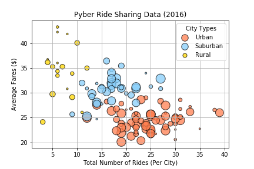
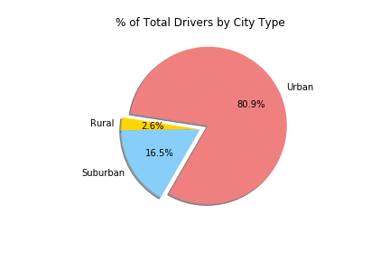

# Case Study: PyBer Customer Data Visualization

The overall goal of this project was to create a snapshot of the startup company PyBer ride sharing service. 

### Results

* Each bubble represents a different city and the size of the bubble is the number of driver: 

* Less than 20% of the drivers are in suburban or rural cities: 

### Conclusion

* Focus our marketing efforts on urban cities and conduct further research into how customer experience is impacted by changes in fares and the quality of the drivers. 
